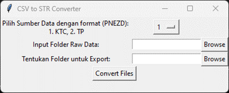
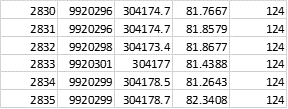
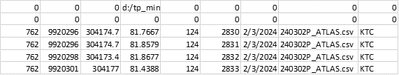
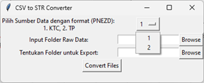
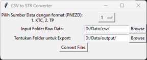
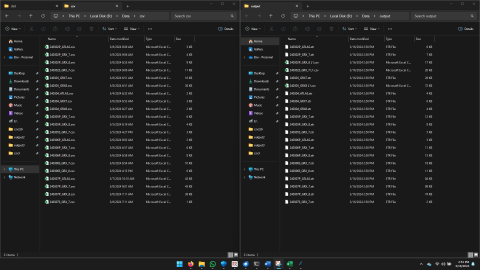

# Tutorial Penggunaan CSV to STR Converter

Tool ini digunakan untuk merubah raw data survey berformat Point Northing Easting Elevation Description seperti berikut

Menjadi format surpac (str) String (Number) Northing Easting Elevation dan opsionalnya yaitu Description, Point, Tanggal, Nama Raw Data, dan Sumber Data. Program ini menggunakan dictionary khusus sesuai format ssi surpac.

Langkah Penggunaan:

Sebelum menggunakan program pastikan data berformat PNEZD dan penamaan file mengikuti format penanggalan waktu pengambilan data contoh 240302P_ATLAS.csv 6 digit pertama digunakan untuk pengisian tanggal pada kolom no 7

1. Pilih sumber data yaitu no 1. KTC / 2. TP

2. Tentukan input folder raw data csv dan output hasl konversinya

3. Pilih Convert Files, lalu tunggu hingga proses selesai

Berikut hasil konversinya

Jika terdapat file dengan nama akhir L1 maka ada beberapa string yang perlu diubah manual